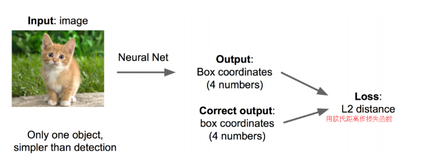

RCNN的思路
卷积神经网络已经帮助我们完成了图像识别的任务，我们接下下来，只需要添加一些额外的功能来完成定位即可。
定位的问题解决思路有哪些
## 思路一:
将定位的问题看作是回归的问题，我们需要预测出四个参数的位置，然后得到方框的位置

该思路的步骤操作如下：

1.搭建简单的图像识别的网络，在此基础上做fine-tuning的训练
2.在神经网络的尾端加两个头，一个分类头，一个检测头
变成了(regression + classfication)
3.regression的部分用欧式距离来计算损失，使用sgd训练
4.预测部分加两个头加在一起

思路一需要做两次fine-tuning训练，第一次在Alexnet上面做，第二次将头部改为regression head，前面不变做一次fine-tuning

Regression的部分加在哪里？
有两种处理办法：
1.加在最后一个卷积层的后面(如VGG)
2.加在最后一个全连接层的后面

## 思路2：取窗口图像
还是刚才的classification +regression的思路
咱们取不同大小的框，让框出现在不同的位置上，得出框的判定得分
取出得分最高的框
总结一下思路：
对于同一张图像来说，使用各种大小的框将图像截取出来，然后输入到cnn中，然后cnn会输出这个框的得分以及这个框对应的regression.
由于这个方法耗时太长了，
把全连接层改为卷积层，减少参数

物体检测的部分
当图像里面有很多物体怎么办
把这个问题看作是分类问题
，那么看成是分类的问题有什么不妥呢
1.你需要找出很多个位置，然后给出很多个不同大小的框
2.你还需要对于框内的图像进行 分类

但是框太多了也不行，不需要尝试那么多框的位置
有人想到了一个好办法：
找出可能包含物体的框，这些框本身是相互重叠互相包含的，这样我们就可以避免暴力枚举所有的框了。
